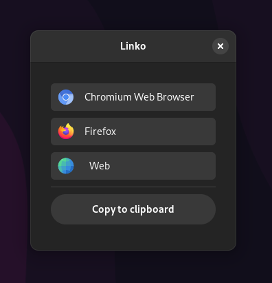

# Linko

Linko is a GTK4/libadwaita tool for launching URLs with the browser of your choice. With Linko, you can quickly and easily switch between different browsers to open links, without having to worry about any complicated setup or configurations.



This app was inspired by Junction, a similar tool. In fact, if Junction did not suffer from slow performance (at least in my setup) and if it had been easier to set up, i wouldn’t have created Linko.

## Tutorial

### Installation:

<details>
<summary>Via package manager</summary>

- TODO!

</details>

<details>
<summary>Download from releases</summary>

<br>  1. Download the binary and the desktop entry from the <a href="https://github.com/rodraah/linko/releases">releases</a> page<br>
<br>  2. Move the binary to somewhere in your $PATH
    
```sh
# If your $PATH includes ${HOME}/.local/bin: 
mv linko ${HOME}/.local/bin
```

<br>  3. Move the desktop entry to your applications folder
    
```sh
mv Linko.desktop ${HOME}/.local/share/applications/
```

</details>
<details>
<summary>Build from source</summary>

- Build dependencies:

  !TODO
  
<br>  1. Clone the repository
    
```sh
git clone https://github.com/rodraah/linko.git
cd linko
```
    
<br>  2. Build it with cargo
    
```sh
cargo build --release
```
    
<br>  3. Move the binary to somewhere in your $PATH
    
```sh
# If your $PATH includes ~/.local/bin: 
mv target/release/linko ${HOME}/.local/bin
```
    
<br>  4. Move the desktop entry to your applications folder
    
```sh
mv Linko.desktop ${HOME}/.local/share/applications/
```
</details>

### Set as default browser

If you want linko to open whenever you click in a URL, you'll need to set it up as your default browser:

```sh
xdg-settings set default-web-browser linko.desktop
```

### Add browsers to linko

To add browsers to linko, you simply need to copy the browser’s desktop entry to the Linko config folder located in `~/.config/linko`. You can find your desktop entries in /usr/share/applications, or you can create one if you are familiar with the process.
